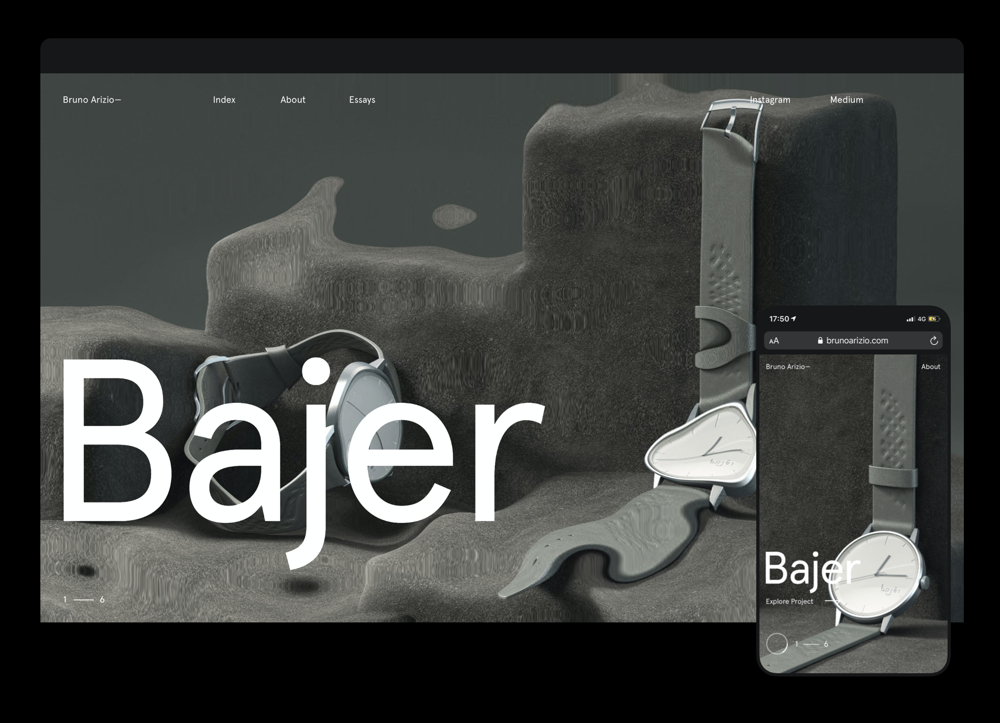

# Bruno Arizio

[](http://standardjs.com/)

[](https://brunoarizio.com/)

This is the repository of [Bruno Arizio](http://brunoarizio.com/) portfolio. We decided to be transparent and take a step forward in making this entire project open source so people can learn how to make the things we created. The website was awarded at [Awwwards](https://www.awwwards.com/) with Site of The Day and Developer Award in [November 25, 2019](https://www.awwwards.com/sites/bruno-arizio-portfolio).

## Overview

### Front End

The front end of the portfolio was made entirely with plain JavaScript code using ECMAScript 2015+ features without any frameworks like Angular, React or Vue. It's also using libraries such as [GSAP](https://greensock.com/), [Locomotive Scroll](https://locomotivemtl.github.io/locomotive-scroll), [Lodash](https://lodash.com/) and [Three.js](https://threejs.org/). To generate our static files that will be uploaded to the environment, we're using [Webpack](https://webpack.js.org/).

### Back End

The back end of the portfolio was made with [Express](https://expressjs.com/) and [Prismic](https://prismic.io/). There's nothing fancy happening in the logic of it, it's just a bunch of routes and some data that will populate our [Pug](https://pugjs.org/api/getting-started.html) views.

# Getting Started

You need to have [Node.js](https://nodejs.org/en/) and [npm](https://www.npmjs.com/) installed in your machine, these are our only dependencies to run the project locally.

After that, you need to setup an account at [Prismic](https://prismic.io/) and create your fields with the same names used by this application, in the end of this README file you're able to find all the instructions related with it.

We're using a `.env` file to retrieve our credentials used by Prismic and also the Google Analytics ID. So you need to create a `.env` file in the root of this application like this:

```
GOOGLE_ANALYTICS=YOUR_GOOGLE_ANALYTICS

PRISMIC_ACCESS_TOKEN=YOUR_ACCESS_TOKEN
PRISMIC_CLIENT_ID=YOUR_CLIENT_ID
PRISMIC_CLIENT_SECRET=YOUR_CLIENT_SECRET
PRISMIC_ENDPOINT=YOUR_ENDPOINT
```

After creating your `.env` file and setting up your Prismic account, you're able to run your project without any problems by running the commands below in your terminal.

```sh
# Clone the project.
git clone https://github.com/lhbzr/bruno-arizio.git

# Install npm depedencies.
npm install

# Configure .env variables and run the website.
npm start
```

# Prismic

I think this might be the trickiest part of running this project locally, you need to understand how Prismic works, then create your fields there and then finally populate the content. To make your life easier, I'm providing all JSON structures inside the `prismic` folder of this repository. Don't forget to match the names used in the JSON files with the ID of your Custom Type of Prismic.

You'll also notice a `images` folder inside the `prismic` folder. By the time I've developed this portfolio, I wasn't aware of `three-bmfont-text` approach. You can see how it works in [this very nice article by Mario Carrillo available at Codrops](https://tympanus.net/codrops/2019/10/10/create-text-in-three-js-with-three-bmfont-text/). So I have used Canvas API to generate these images and then I was loading them as textures for the text of the website. (😂) So, when creating your project in Prismic, you'll have two fields for these images `Fill` and `Stroke`, you just need to include the respective ones from this folder.

# Credits

That's all folks! I hope this repository might be useful for your learnings. When I was starting my career, I've learned a lot from [Bruno Imbrizi](https://github.com/brunoimbrizi/), [Giulian Drimba](https://github.com/giuliandrimba) and [Silvio Paganini](https://github.com/silviopaganini) public repositories, among many others public repositories made by incredible people. So I'm doing it too as a way to contribute with the growth of the community as well.
